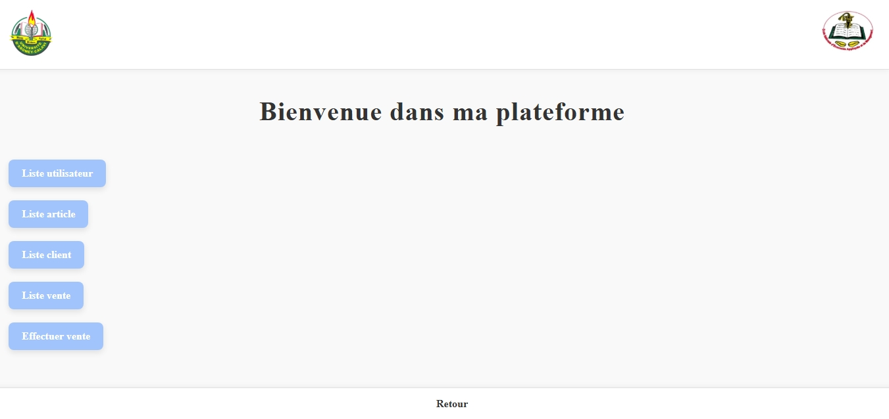
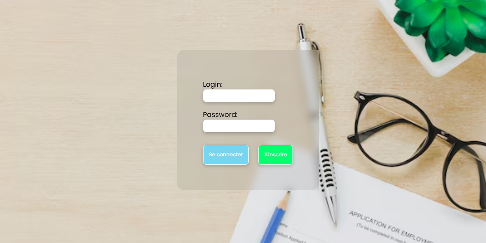
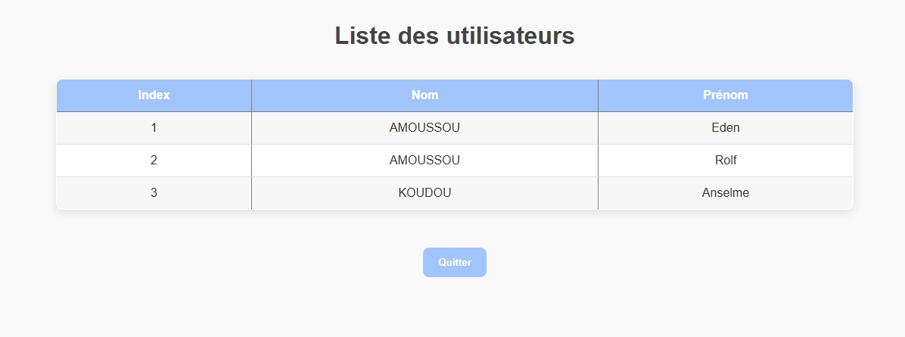
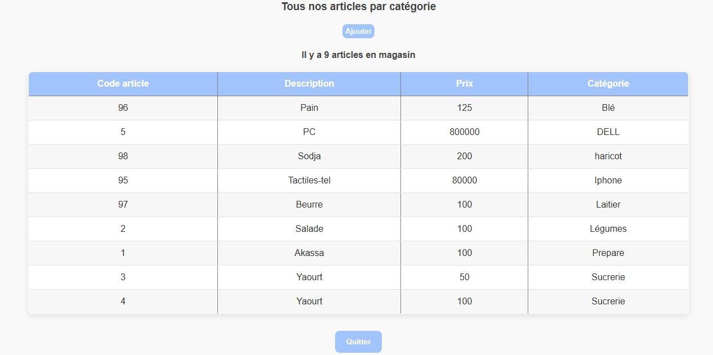
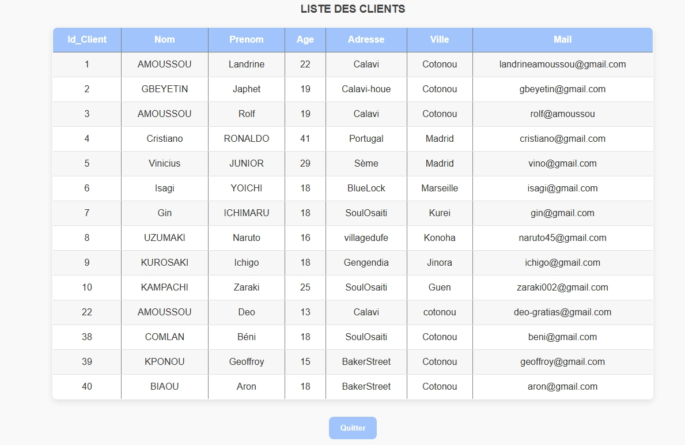
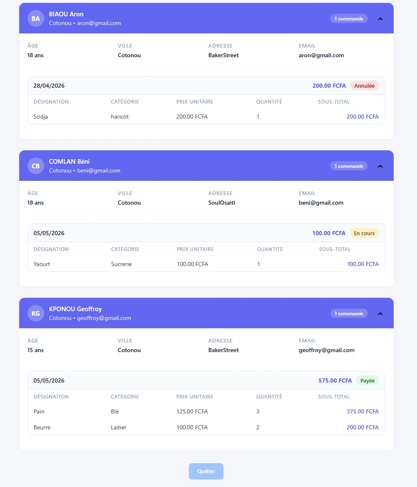
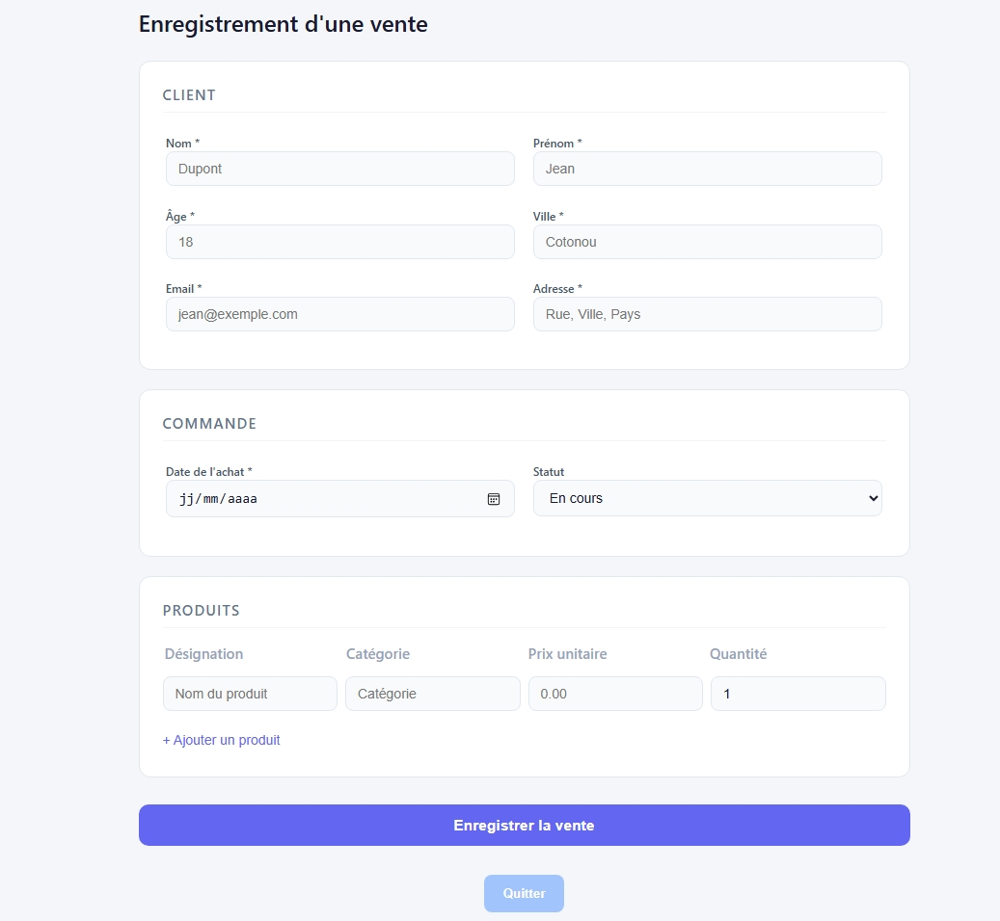

# Plateforme de gestion PHP

**Auteur:** AMOUSSOU Lewis

**Classe:** IG2/B

Ce projet est une petite application PHP/MySQL de gestion d'utilisateur, d'articles et de ventes. Il fonctionne localement avec XAMPP (Apache + MySQL) et utilise des pages PHP simples pour l'authentification, l'inscription et l'affichage des listes.

## Fonctionnalités

- Authentification via `index.php`
- Inscription d'un utilisateur via `formulaireuser.php`
- Tableau de bord principal dans `accueil.php`
- Consultation de la liste des utilisateurs (`voiruser.php`)
- Consultation / ajout d'articles (`voirarticle.php`, `ajouterarticle.php`)
- Gestion des clients et des ventes via les pages existantes (`voirclient.php`, `voirlistevente.php`, `voirvente.php`)

## Prérequis

- XAMPP installé sur Windows
- PHP 7.x ou 8.x
- MySQL/MariaDB
- Un navigateur web

## Installation

1. Copier le dossier `projetphp` dans le dossier `htdocs` de XAMPP.
2. Démarrer Apache et MySQL depuis le panneau de contrôle XAMPP.
3. Ouvrir `http://localhost/phpmyadmin`.
4. Créer une base de données nommée `essaiebdd`.
5. Importer ou créer les tables nécessaires.

## Configuration de la base de données

Le fichier de connexion est `connexion.php`.

```php
define("host","localhost");
define("user","root");
define("pass","");
define("nameBDD","essaiebdd");
$connect=new mysqli(host,user,pass,nameBDD);
```

### Tables attendues

Au minimum, le projet utilise ces tables :

- `user`
  - `id_user`
  - `nom`
  - `prenom`
  - `contact`
  - `login`
  - `password`

- `article`
  - `id_article`
  - `designation`
  - `prix`
  - `catégorie`

> Les autres tables (`client`, `vente`, `listevente`, etc.) sont utilisées par les pages correspondantes mais ne sont pas totalement décrites dans le code existant.

## Utilisation

1. Ouvrir `http://localhost/projetphp/index.php`.
2. Se connecter avec un compte existant ou cliquer sur "S'inscrire" pour créer un nouveau compte.
3. Après connexion, la page `accueil.php` donne accès aux sections :
   - `Liste utilisateur`
   - `Liste article`
   - `Liste client`
   - `Liste vente`
   - `Effectuer vente`
4. Ajouter un nouvel article avec `ajouterarticle.php`, puis consulter la liste des articles.

## Remarques importantes

- Les mots de passe sont actuellement stockés en clair dans la base de données. Pour une mise en production, utilisez `password_hash()` et `password_verify()`.
- Le code ne contient pas de validation avancée ni de protection contre les injections SQL en dehors de l'utilisation partielle de `prepare()`.
- Vérifiez que les fichiers CSS et les images référencées existent dans le même dossier pour un affichage correct.

## Améliorations possibles

- Ajouter une page de déconnexion
- Protéger les pages accessibles après connexion avec une session PHP
- Renforcer la validation et la sécurité des formulaires
- Ajouter la gestion des erreurs SQL et les messages d'utilisateur plus clairs

## Images du site

Les images suivantes sont incluses dans le dossier du projet et utilisées par le site :

### Logos


### Pages et captures
















> Les fichiers image sont stockés dans le même répertoire que les pages PHP et peuvent être consultés directement dans le navigateur ou le dossier de projet.

---

### Structure des fichiers

- `index.php` : connexion utilisateur
- `formulaireuser.php` : inscription utilisateur
- `accueil.php` : page d'accueil après connexion
- `voiruser.php` : liste des utilisateurs
- `voirarticle.php` : liste des articles
- `ajouterarticle.php` : ajout d'article
- `connexion.php` : connexion MySQL
- `Readme.md` : documentation du projet
